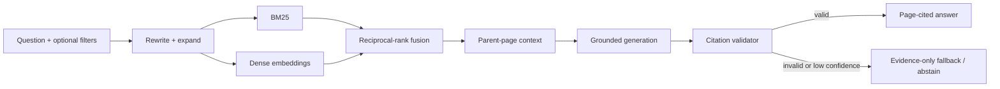

# NirmaanLens Hyderabad

[](https://github.com/Missing-Identity/nirmaan-lens/actions/workflows/ci.yml)

**Source-grounded, time-aware building-permission intelligence for Hyderabad.**

NirmaanLens is now a runnable local RAG prototype. It can ingest official Telangana PDFs, preserve PDF page numbers through retrieval, combine sparse and dense search, ground generated answers in retrieved evidence, validate citations, abstain on weak evidence, and show retrieval metrics in a Streamlit dashboard.

> The software provides preliminary informational research. It is not a government approval, legal opinion, architectural certification, title report, or substitute for a licensed professional.

## Try it locally

Requirements: macOS/Linux, Python 3.11 or newer, Git, and Make.

```bash
git clone https://github.com/Missing-Identity/nirmaan-lens.git
cd nirmaan-lens
make setup
make demo
```

Open the URL Streamlit prints, normally <http://localhost:8501>. The bundled corpus is synthetic, so the UI works immediately without downloading government PDFs or spending API credits.

An OpenAI key is optional. Without one, the app runs local BM25 plus deterministic feature-hash retrieval and displays extractive evidence. To enable semantic embeddings and grounded answer generation:

```bash
cp .env.example .env.local
# Add OPENAI_API_KEY to .env.local, then restart:
make run
```

See the [complete local runbook](docs/RUN_LOCAL.md) for Apple Silicon setup, official corpus ingestion, tests, and troubleshooting.

## Load official Telangana sources

The versioned [source manifest](sources/manifest.json) starts with the Building Rules, TS-bPASS Act and Rules, 2026 amendments, HMDA planning material, and Telangana Fire sources.

```bash
# First prove the path with one PDF:
.venv/bin/nirmaan-lens fetch-official --limit 1
.venv/bin/nirmaan-lens ingest-official
.venv/bin/streamlit run app.py

# Then fetch the complete starter manifest:
.venv/bin/nirmaan-lens fetch-official
.venv/bin/nirmaan-lens ingest-official
```

PDF pages with insufficient embedded text are reported as needing OCR rather than silently indexed as empty evidence. Run this command to restore the synthetic demo:

```bash
.venv/bin/nirmaan-lens bootstrap-demo --force
```

## What exists in v0.1

- Page-aware PDF parsing with source/page citation keys
- 550-token chunks with 75-token overlap and parent-page expansion
- BM25 sparse retrieval plus OpenAI dense embeddings or a zero-cost local test provider
- Reciprocal-rank fusion, query alias expansion, and authority/topic filters
- Content-addressed embedding cache
- Confidence gating and explicit abstention
- Grounded Responses API generation with a citation allow-list validator
- Extractive fallback when generation or citation validation fails
- 60-case synthetic silver evaluation suite, including 10 adversarial/unanswerable cases
- Hit Rate, MRR, NDCG, abstention, latency, and baseline-comparison reporting
- Streamlit UI with Ask, Retrieval Lab, Evaluation, and Sources views
- Official-source download manifest and ingestion report

The [implementation status](docs/IMPLEMENTATION_STATUS.md) separates shipped behavior from planned cross-encoder reranking, ColBERT late interaction, full temporal amendment resolution, OCR, and official-domain web fallback.

## Current benchmark

The checked v0.1 run compares a deliberately naive dense top-5 baseline with hybrid top-10 on the bundled 60-case synthetic silver suite. These numbers validate the harness and regression behavior; they are **not** evidence of real-world regulatory accuracy.

| Pipeline | Hit Rate | MRR | NDCG | Abstention F1 |
|---|---:|---:|---:|---:|
| Naive dense top-5 | 0.980 | 0.791 | 0.839 | 0.741 |
| Hybrid top-10 | **1.000** | **0.881** | **0.910** | **0.952** |
| Improvement | +0.020 | +0.089 | +0.071 | +0.212 |

Reproduce it with:

```bash
make eval
```

The next credible benchmark is an official-document development set with independently verified source IDs and pages. See [Dataset Bootstrap](docs/DATASET_BOOTSTRAP.md) and [Evaluation Plan](docs/EVALUATION_PLAN.md).

## Why this problem

Hyderabad development rules are distributed across building rules, amendments, government orders, master plans, zoning regulations, lake notifications, fire-safety requirements, permission portals, and regulatory orders. A useful answer may depend on jurisdiction, proposal date, plot area, road width, use, height, and an exception introduced by a later amendment.

NirmaanLens is intended to give junior architects, civil engineers, small builders, and technically confident homeowners an evidence trail across those sources while refusing to invent certainty when evidence or plot facts are incomplete.

## Architecture



The production target adds temporal source relationships, OCR/table handling, ColBERT late interaction, cross-encoder reranking, deterministic regulatory calculations, and approved-domain web fallback. See [System Architecture](docs/architecture/SYSTEM_ARCHITECTURE.md).

## Repository map

```text
app.py                         Streamlit application and quality dashboard
src/nirmaan_lens/             Ingestion, retrieval, generation, grounding, eval, CLI
fixtures/demo_corpus.jsonl    Clearly labeled synthetic runnable corpus
evals/silver_v0.1.jsonl       60-case unreviewed regression/evaluation suite
sources/manifest.json         Versioned official-source registry
tests/                        Unit, retrieval, grounding, benchmark, and app tests
docs/                         Product, architecture, safety, dataset, and runbooks
```

## Development commands

```bash
make doctor
make test
make eval
.venv/bin/nirmaan-lens ask "What is an OC?" --provider local --no-generation
```

## Authoritative source families

- [Telangana BuildNow — Government Orders and Acts](https://buildnow.telangana.gov.in/go-and-act/)
- [TG-bPASS](https://tgbpass.telangana.gov.in/)
- [Hyderabad Metropolitan Development Authority](https://www.hmda.gov.in/)
- [HMDA Lakes](https://lakes.hmda.gov.in/)
- [Telangana Fire and Emergency Services](https://fire.telangana.gov.in/)
- [Telangana RERA](https://rera.telangana.gov.in/)

Inclusion in the source registry does not imply that every record may be redistributed or that its applicability has been professionally reviewed. The [source policy](docs/SOURCE_POLICY.md) distinguishes indexed public text, metadata-only records, user-supplied documents, and restricted material.

## License

MIT License. See [LICENSE](LICENSE).
