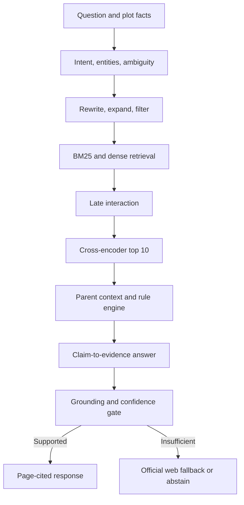

# NirmaanLens Hyderabad

**Source-grounded, time-aware building-permission intelligence for Hyderabad.**

NirmaanLens helps architects, civil engineers, small builders, and homeowners answer a deceptively hard question:

> What can be proposed on this plot, which approvals may apply, and which exact government rule supports the answer?

The project is currently in the **architecture and corpus-design phase**. Application code will begin only after the source, retrieval, evaluation, and safety contracts have been reviewed.

## The problem

Hyderabad development rules are distributed across building rules, amendments, government orders, master plans, zoning regulations, lake notifications, fire-safety requirements, permission portals, and regulatory orders. A useful answer may depend on jurisdiction, proposal date, plot area, road width, use, height, and an exception introduced by a later amendment.

Existing portals publish or process parts of this information. NirmaanLens is intended to provide a single evidence trail across them while refusing to invent certainty when evidence or plot facts are incomplete.

## Initial users

- **Primary:** junior architects, civil engineers, and small building-permission consultancies
- **Secondary:** small builders and technically confident homeowners
- **Later:** property buyers performing preliminary approval checks

## Product modes

1. **Ask a rule** — answer a regulatory question with exact PDF pages.
2. **Check a proposal** — combine plot facts, retrieved rules, and deterministic calculations.
3. **Explain a change** — compare the rule applicable before and after an amendment.
4. **Build an evidence packet** — export assumptions, calculations, unresolved questions, and citations for professional review.

## Design principles

- **Evidence before fluency:** no material claim without traceable support.
- **Version awareness:** determine which rule applied for the requested date.
- **Deterministic calculations:** the language model explains; it does not improvise regulatory arithmetic.
- **Abstention is a feature:** missing road width, jurisdiction, date, or evidence must produce a clarification or qualified answer.
- **Official-source fallback:** low-confidence retrieval may search approved government domains, never silently substitute generic web content.
- **Measurable retrieval:** every retrieval improvement must earn its place through ablation testing.

## Proposed architecture



See [System Architecture](docs/architecture/SYSTEM_ARCHITECTURE.md) for the complete component and data-flow design.

## Planned retrieval stack

- Page-aware PDF and OCR ingestion
- 550–700-token child chunks with at least 75-token overlap
- Hierarchical parent-section retrieval
- BM25 plus multilingual dense retrieval with reciprocal-rank fusion
- Late-interaction scoring followed by cross-encoder reranking
- Temporal and jurisdiction metadata filtering
- Sentence-level claim-to-citation grounding
- Content-addressed embedding and query caching
- Official-domain web fallback under a strict confidence policy

Model and database choices remain replaceable until corpus pilots and evaluation results justify a final decision.

## Evaluation commitment

The initial golden set will contain at least 60 reviewed questions across exact lookups, amendment reasoning, plot scenarios, ambiguity, OCR/tables, and unanswerable or adversarial prompts.

The project will report:

- Hit Rate@5 and @10
- MRR@10
- NDCG@10
- Citation precision and citation coverage
- Grounded-claim rate
- Abstention precision, recall, and F1
- p50/p95 latency and cache-hit rate
- Measured improvement over a naive dense top-5 baseline

See [Evaluation Plan](docs/EVALUATION_PLAN.md).

## Repository map

```text
docs/
  architecture/       System design and architecture decisions
  PRODUCT_SCOPE.md    Users, workflows, MVP, and non-goals
  SOURCE_POLICY.md    Authority, freshness, provenance, and fallback rules
  EVALUATION_PLAN.md  Golden set, metrics, targets, and ablations
  ROADMAP.md          Delivery milestones and initial issue backlog
  THREAT_MODEL.md     Safety, prompt injection, privacy, and misuse controls
```

## Current phase

- [x] Product hypothesis and initial landscape review
- [x] Architecture and safety boundaries
- [x] Evaluation and benchmark design
- [ ] Interview 10–15 domain users
- [ ] Freeze the MVP jurisdiction and source manifest
- [ ] Ingest the first 30–50 official PDFs
- [ ] Build the naive retrieval baseline

## Authoritative source families

The initial corpus will prioritize official material from:

- [Telangana BuildNow — Government Orders and Acts](https://buildnow.telangana.gov.in/go-and-act)
- [TG-bPASS](https://tgbpass.telangana.gov.in/)
- [Hyderabad Metropolitan Development Authority](https://www.hmda.gov.in/)
- [HMDA Lakes](https://lakes.hmda.gov.in/)
- [Telangana Fire and Emergency Services](https://fire.telangana.gov.in/)
- [Telangana RERA](https://rera.telangana.gov.in/)

Inclusion in the source registry does not imply that every record may be redistributed. The source policy distinguishes indexed public text, metadata-only records, user-supplied documents, and restricted material.

## Safety and legal boundary

NirmaanLens provides preliminary informational analysis. It is not a government approval, legal opinion, architectural certification, title report, or substitute for a licensed professional. A high confidence score means the retrieved evidence supports the displayed claims; it does not certify that a proposal will be approved.

## License

MIT License. See [LICENSE](LICENSE).
