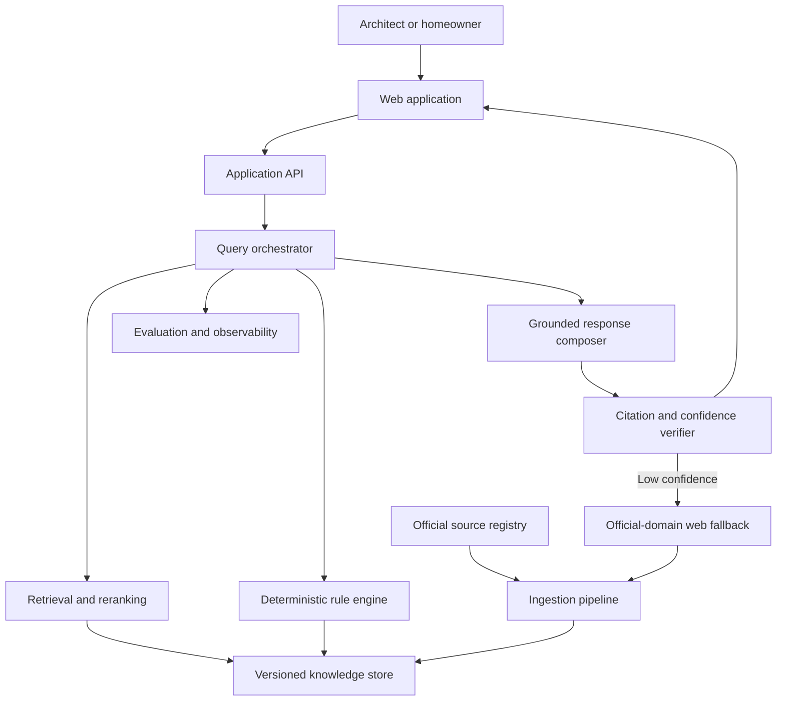

# System Architecture

## Architectural goal

Produce preliminary regulatory answers whose claims can be traced to authoritative pages, whose calculations are reproducible, and whose temporal and jurisdiction assumptions are visible.

This is a hybrid decision-support system, not an unconstrained document chatbot.

## Context diagram

## Major components

### 1. Source registry

The registry is the control plane for the corpus. Every source receives a stable identifier and records:

- publisher and authority tier;
- canonical URL and retrieval time;
- document title, number, and type;
- publication, effective-from, and effective-to dates;
- jurisdiction and affected topics;
- file checksum and parser version;
- amendment, clarification, and supersession relationships;
- redistribution and retention classification.

No downloaded document is searchable until it has a registry record and passes provenance validation.

### 2. Acquisition and ingestion

Stages:

1. Fetch an allowlisted official source.
2. Store the original immutable file and checksum.
3. Detect native text versus scanned/OCR pages.
4. Extract page text, headings, tables, footnotes, and bounding boxes.
5. Flag low-confidence OCR or malformed tables for review.
6. Construct parent sections and child chunks.
7. Attach source, temporal, jurisdiction, and page metadata.
8. Generate dense, sparse, and late-interaction representations.
9. Publish only after automated and manual sampling checks pass.

### 3. Versioned knowledge store

The logical store has four layers:

- **Original documents:** immutable PDFs/images and content hashes
- **Provenance database:** source registry, page records, sections, amendment graph, and review state
- **Retrieval indexes:** BM25/sparse, dense vector, and optional late-interaction token vectors
- **Cache:** content-addressed document embeddings, query embeddings, retrieval results, and verified official-web snapshots

The implementation may use separate physical systems, but the contracts must not depend on a specific vendor.

### 4. Query understanding

The query-understanding stage emits a structured request rather than a free-form rewritten string:

- intent: lookup, proposal check, change comparison, document question, or unsupported request;
- normalized units and entities;
- locality, authority, as-of date, use, plot area, road width, height, and floors;
- missing decision-critical fields;
- legal aliases and retrieval expansions;
- metadata filters and filter confidence;
- whether clarification is required before retrieval.

Query rewriting normalizes one interpretation. Query expansion produces multiple retrieval formulations. They are evaluated separately.

### 5. Hybrid retrieval

Default candidate path:

1. BM25/sparse retrieval for exact clauses, table identifiers, GO numbers, and terminology.
2. Dense retrieval for paraphrases and natural-language questions.
3. Reciprocal-rank fusion into a candidate pool.
4. Metadata constraints for authority, jurisdiction, effective date, document type, and topic.
5. Late-interaction scoring to retain token-level legal matches.
6. Cross-encoder reranking to produce the final top ten child passages.
7. Parent expansion to supply the complete clause, exception, or table.

Candidate pool sizes and weights are evaluation parameters, not hard-coded product truths.

### 6. Deterministic rule engine

The rule engine handles operations that must be reproducible:

- unit conversion;
- threshold and range checks;
- lookup-table evaluation;
- formula-based calculations;
- required-input validation;
- effective-date selection;
- explanation traces identifying which structured rule fired.

Rules are derived from cited documents, versioned, reviewed, and tested against boundary cases. Retrieval provides the rule evidence; the engine computes the scenario; the language model explains both.

### 7. Grounded response composer

The composer generates a structured draft:

- direct answer state;
- material claims;
- claim-level evidence identifiers;
- calculations and input provenance;
- conditions, exceptions, and missing facts;
- source conflict notes;
- confidence factors;
- disclaimer class.

The UI prose is rendered only after verification.

### 8. Citation and confidence gate

For every material claim, the verifier checks:

- an authoritative source is attached;
- the cited page contains the supporting passage;
- the passage entails or directly supports the claim;
- the source was effective for the requested date;
- no higher-authority or later applicable source conflicts;
- numeric claims match the deterministic trace;
- citation coverage meets the answer-state threshold.

Failed claims are removed, qualified, or cause the response to abstain. Citation grounding reduces hallucinations; it cannot guarantee their total elimination.

### 9. Official-domain web fallback

Fallback is triggered only when indexed retrieval is insufficient because of freshness or corpus coverage. It searches a controlled allowlist, records retrieval time, and labels the result as fallback evidence.

New web material is not silently promoted into the durable corpus. It remains ephemeral until source identity, document integrity, effective date, and parser quality are verified.

### 10. Evaluation and observability

Every production-like query records privacy-safe traces for:

- query category and filters;
- candidate ranks and scores;
- final evidence set;
- answer state and verifier outcome;
- latency by stage;
- cache outcome;
- fallback trigger;
- human feedback and error category.

The evaluation harness can replay the same request across baseline and experimental pipelines.

## Chunking contract

### Child chunks

- Target 550–700 tokens
- Minimum 75-token overlap for ordinary prose
- Never cross document boundaries
- Record page start/end and character/bounding-box offsets
- Prepend document, chapter, section, and table context

### Parent units

- Complete clause, section, schedule, or table
- Normally 1,500–3,000 tokens
- May be larger when splitting would detach an exception or table header
- Children reference exactly one primary parent and may reference related parents

### Tables

- Keep row labels and column headers together
- Repeat headers for page-spanning tables
- Store a faithful text representation and structured cells
- Preserve notes, symbols, and footnotes
- Test boundary values directly in the rule engine

### Amendments

An amending clause is not merged destructively into the base text. The system keeps both source versions and builds an effective view for a requested date. This preserves auditability and supports before/after questions.

## Core logical entities

| Entity | Purpose |
|---|---|
| `SourceRecord` | Authority, URL, checksum, rights, and acquisition state |
| `DocumentVersion` | Publication/effective dates, jurisdiction, and amendment links |
| `Page` | Original page identity, text, OCR quality, and coordinates |
| `Section` | Hierarchical parent context |
| `Chunk` | Searchable child text and representations |
| `StructuredRule` | Reviewed deterministic condition and source trace |
| `QueryCase` | Normalized question, facts, filters, and intended answer state |
| `EvidenceSet` | Ranked passages and parent expansions used for an answer |
| `Claim` | Material statement linked to evidence and verification result |
| `EvaluationRun` | Pipeline version, metrics, latency, and failure analysis |

## Confidence model

Confidence is not a single model probability. It is composed from:

- required-input completeness;
- authority and freshness of sources;
- retrieval agreement and rank margin;
- temporal/jurisdiction filter certainty;
- claim-support coverage;
- source conflicts;
- deterministic validation status;
- OCR/parser quality.

The user sees a plain-language confidence explanation rather than an unexplained percentage.

## Security and privacy boundaries

- Public regulatory questions may be logged after removing direct identifiers.
- Uploaded private documents are isolated by tenant and excluded from the public corpus.
- Retrieved text is treated as untrusted data, not executable instruction.
- Prompt injection inside a source document cannot change system policy or tool access.
- Web fallback cannot browse outside the approved source policy.
- Evidence packets distinguish user-supplied facts from official evidence.

See [Threat Model](../THREAT_MODEL.md).

## Deployment shape for the MVP

The first deployable version should remain operationally simple:

- web frontend;
- stateless application/query API;
- background ingestion workers;
- relational provenance store;
- object storage for source files;
- search/vector service;
- cache;
- evaluation/observability store.

The rule engine may run inside the application service initially but must retain a separate interface and test suite.

## Open decisions

- Which exact jurisdictions and document chain define MVP coverage?
- Which parser gives the best table/page fidelity on the pilot corpus?
- Whether one multi-representation embedding model is sufficient or separate models perform better
- Search platform: combined hybrid engine versus separate sparse/vector stores
- Late-interaction operating cost and index size
- Human-review workflow for structured rules and amendments
- Confidence calibration thresholds for fallback and abstention

These decisions will be closed through corpus pilots and evaluation, not preference alone.
